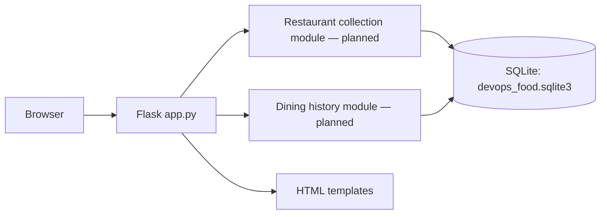
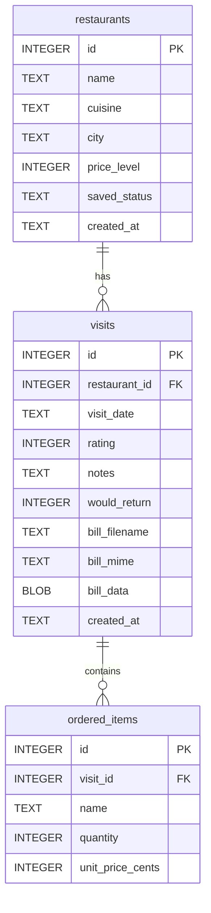

# Assignment 1 report — working outline

**Status:** Scaffold draft. Expand this to a 4–5 page report after the application and tests exist. Replace future-tense statements with what was actually built, and make both diagrams match the final code and SQLite schema.

## 1. Use case, stakeholder, and SMART goals

The proposed stakeholder is a person who wants one private place to keep restaurants they plan to try and a record of visits they have made. The professor approved the restaurant discovery and dining-history idea. Restaurant collection and dining history are the two backend feature areas.

Before submission, write specific, measurable goals for the finished app. Examples to evaluate and adapt: save a restaurant with cuisine, city, and price level in under one minute; retrieve a filtered list; record a visit with orders and an optional bill; keep all saved data after restart; reach at least 70% unit-test coverage of domain logic. Only claim a goal was met after checking it.

## 2. SDLC model and actual practice

The planned model is short iterative development. The first iteration is this deployable scaffold and schema; later iterations will add restaurant behavior, then visit behavior and uploads, then tests and final documentation. This fits a small individual project because each iteration can be run and inspected, and later findings can revise the next step. The final report should state where actual work followed or diverged from this plan, with dates or commits as evidence.

## 3. Architecture overview

The current scaffold has one Flask process and one SQLite file. The domain modules and UI actions below are planned; remove or update any box that is not present in the final submission.

The intended boundary is between restaurant facts and filtering on one side, and dated visits with orders and bills on the other. Both remain in one process and one database for Assignment 1.

## 4. Database model

This diagram matches the initial schema in `storage.py`. Recheck it against the final schema before submission.

`visits.restaurant_id` points to one saved restaurant; `ordered_items.visit_id` points to one visit. The bill is stored on the visit row, so the app needs no second persistent path. The schema uses checks for price level, status, rating, return choice, quantity, and nonnegative price.

## 5. Testing, deployment contract, and reflection

**Pending implementation:** describe the actual unit tests for each domain, paste the coverage command and measured result, and explain what remained thin. Confirm that `python app.py` starts one process on `0.0.0.0`, uses `PORT`, initializes `DATA_DIR/devops_food.sqlite3`, and needs no interactive setup. Explain any tradeoffs discovered while implementing uploads, filtering, and privacy.

## AI disclosure statement

I acknowledge the use of OpenAI Codex to read the assignment, organize the repository, and draft an initial Flask/SQLite scaffold and document outlines. The prompts used include “read the assingment md and htne set up the repo so it fills all the required documents fo the assingment” and “just build the scaffold dont one shot the whole app”. The output of these prompts was used to create the initial project structure and draft documentation, which I will review and revise against the code and my own decisions before submission.
