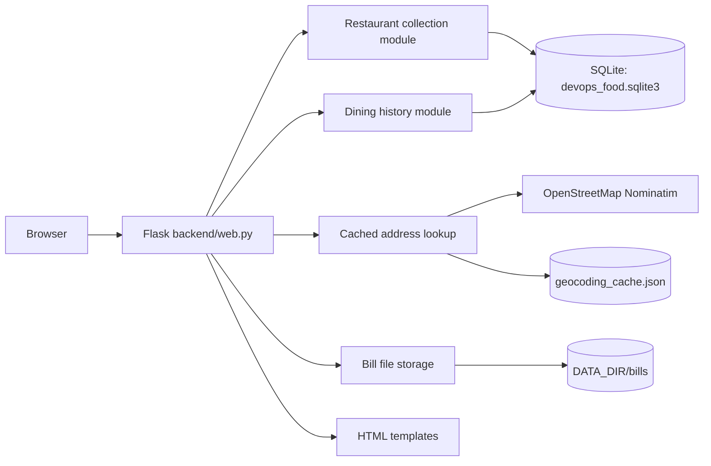
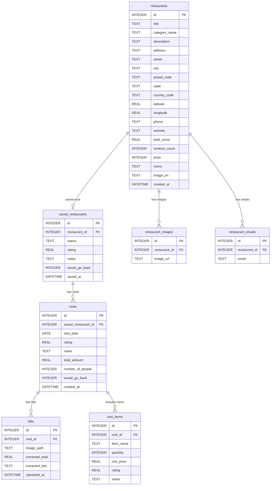

# Assignment 1 report — Picky

**Completed:** 2026-10-04. This report describes the single-process Flask application on the submission branch.

## 1. Use case, stakeholder, and SMART goals

The stakeholder is a person who wants one local journal for restaurants they plan to try and places they have visited. They need to distinguish a general restaurant record from their own status, notes, and repeated dining experiences. The professor approved this use case. The two backend feature areas are restaurant collection and dining history.

| Goal by 2026-10-04 | Evidence |
|---|---|
| Save a restaurant with a name and status in one form submission, and keep it after restart. | A fresh-start process test submitted the form, received a successful response, and found a saved row in the new SQLite file. |
| Narrow the catalog by cuisine, city, price, personal rating, or saved status, with filters that can be combined. | Domain and route tests check individual and combined filters, empty results, and invalid input. |
| Record a dated visit and at least one ordered item for a saved restaurant. | The visit and item forms write to SQLite; tests verify the items stay with the correct visit. |
| Reach at least 70% measured coverage of the two core domains. | The final test command passed 65 tests with 97% combined domain coverage. |

These targets are specific to the local app and can be checked without claiming an unmeasured time saving or production scale. A person can also attach a PNG, JPEG, or PDF bill to a visit; this is useful but was not needed to count either domain as working.

## 2. SDLC model and actual practice

I used short iterations: get a runnable slice, inspect it, then add one behavior at a time. On 2026-09-29 the repository began with a Flask/SQLite scaffold and two proposed domain boundaries. On 2026-09-30 the supplied seven-table schema, saved-list forms, and catalog page were added. On 2026-10-01 the detail page, visits, and bill uploads connected the two domains. On 2026-10-02 location lookup used the address and coordinate columns already present in the schema. On 2026-10-03 the address search was corrected after a real query combined Madrid with an unrelated saved city, a manual coordinate fallback was added, and domain tests were expanded. On 2026-10-04 the catalog gained filters, visits gained ordered items, personal saved details became editable, and the final tests and documents were checked.

This sequence mostly followed the iterative plan, but the geocoding failure changed the next step: it was more valuable to repair and test that flow than to add another broad feature immediately. The two domains remained in one process as required. Each iteration could run locally, and its commit records the change. The final scope deliberately stops short of login, receipt extraction, and a physical service split. Those would require additional design and testing without improving the core Assignment 1 deployment contract.

## 3. Architecture overview

One Flask process serves the HTML, handles form submissions, and calls two Python domain modules. Both modules use one SQLite file at `DATA_DIR/devops_food.sqlite3`. Uploaded bill files and a JSON address-lookup cache live under the same `DATA_DIR`; they are not extra services. Flask handles input and joins the workflows but restaurant collection does not write visit rows and dining history does not change restaurant facts.

Restaurant collection owns `restaurants`, `saved_restaurants`, `restaurant_images`, and `restaurant_emails`. It creates and lists restaurants, manages the saved entry and personal edits, updates location, and applies catalog filters. Dining history owns `visits`, `visit_items`, and `bills`; it records dated experiences and checks bill and item ownership through a saved restaurant ID. The seam for a later split is `saved_restaurants.id`. Recording a visit marks that saved entry `visited` in the same SQLite transaction, so the UI can show the new status immediately. The route checks ownership before an item or bill is attached to a visit.

Address lookup occurs only when the user submits a location. It uses an identifying request header, a local cache, and a single-process request limit. A full address is searched as entered; otherwise the saved city is appended. The first map result can still be imprecise, so the detail page links to the map and allows manual coordinates. Starting the app, adding a restaurant without an address, and entering coordinates manually do not require the lookup service.

## 4. Database model

I supplied the seven-table SQLite schema in `database/schema.sql`. The diagram below shows its relationships; [open the editable DrawSQL version](https://drawsql.app/draw?t=6be2c641-7e9a-43f3-b8b5-2012cfbc8a5a&utm_source=mcp) to inspect all 55 columns. DrawSQL uses PostgreSQL-equivalent type labels; the SQLite file remains authoritative. `SCHEMA.md` gives further detail.

In my schema, `restaurants` contains general details, including `address`, `latitude`, and `longitude`. `saved_restaurants` contains personal status, overall rating, notes, and return preference; its `restaurant_id` is unique. Each saved entry can have several visits, and each visit can have several bills and ordered items. Foreign keys use cascading deletion. There is no `users` table. Uploaded bill files are stored under `DATA_DIR/bills/`, and their relative locations are stored in `bills.image_path`.

Keeping `restaurants` separate from `saved_restaurants` lets an unsaved restaurant remain in the full catalog. Removing the saved entry cascades through its visits, bill rows, and ordered items, while the restaurant row remains. The app also removes the associated managed bill files after that database deletion. The personal rating is `saved_restaurants.rating`; a single visit's rating is `visits.rating`, so the catalog's minimum personal-rating filter never uses a visit score. Monetary fields are `REAL` because that is the supplied schema; no payment totals are calculated in this version.

## 5. Testing, deployment contract, and reflection

On 2026-10-04, `python -m pytest -q --cov=backend.restaurant_domain --cov=backend.dining_history --cov-report=term-missing` passed 65 tests and measured 97% combined coverage of the two domain modules. The domain tests cover validation, saved-list edits and removal, filters, visit status, ordered items, bill ownership, and SQLite cascades. Flask route tests check several form paths using a temporary database. Location tests mock the external address service so they are repeatable and offline. The coverage figure applies to the two core modules; it does not measure every HTML path or guarantee that a map result identifies the correct building.

A fresh-start check launched `python app.py` with a new empty `DATA_DIR` and a nondefault `PORT`, received HTTP 200 from `/health`, submitted a restaurant form, and found its saved row in the new SQLite file. The app binds to `0.0.0.0`, uses `PORT` (default 8000), needs no interactive migration, and keeps one dependency manifest at the repository root. It has no authored Dockerfile, CI workflow, infrastructure code, managed database, or required cache service. The public location API is optional to basic use.

The main limitation is privacy: this version has no login, so notes and bills are appropriate only on a trusted local machine and should not be exposed publicly. A second limitation is map accuracy; the user should inspect the resulting pin or enter coordinates manually. Bill files need backup together with the SQLite file. Authentication, receipt extraction, and multi-service deployment remain future work. The paper comprehension check also requires being able to explain the schema, domain seam, request flow, and test evidence without notes.

## AI disclosure statement

I acknowledge the use of OpenAI Codex to scaffold and organize this Flask and SQLite app, implement my seven-table schema and diagrams, connect my restaurant and dining-history functions to web forms, and help test and document the result. The prompts used include requests to set up the scaffold, wire my functions to the UI, add location lookup and a manual fallback, test both domains, add catalog filters and ordered items, and allow editing personal saved details. The output of these prompts was used for Python routes and domain functions, HTML forms, tests, documentation, and this report draft. I supplied the app idea and schema and will check the code explanations in the AI usage log against my own understanding before submission.
