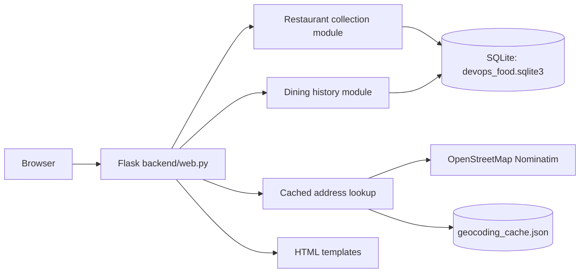
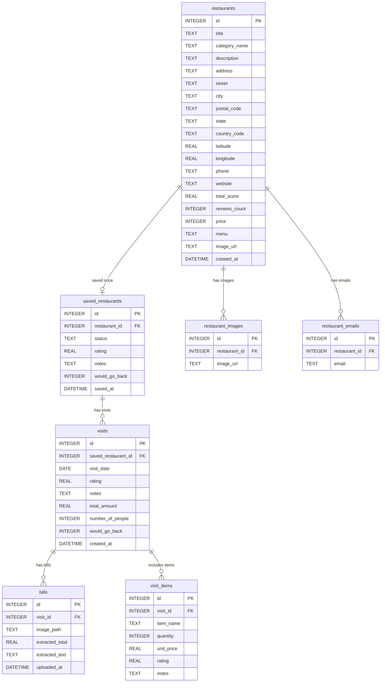

# Assignment 1 report — working outline

**Status:** Scaffold draft. Expand this to a 4–5 page report after the application and tests exist. Replace future-tense statements with what was actually built, and make both diagrams match the final code and SQLite schema.

## 1. Use case, stakeholder, and SMART goals

The proposed stakeholder is a person who wants one private place to keep restaurants they plan to try and a record of visits they have made. The professor approved the restaurant discovery and dining-history idea. Restaurant collection and dining history are the two backend feature areas.

Before submission, write specific, measurable goals for the finished app. Examples to evaluate and adapt: save a restaurant with category, city, and price in under one minute; retrieve a filtered list; record a visit with orders and an optional bill; keep all saved data after restart; reach at least 70% unit-test coverage of domain logic. Only claim a goal was met after checking it.

## 2. SDLC model and actual practice

The planned model is short iterative development. The first iterations produced a deployable scaffold, implemented the student-supplied schema, connected the student's restaurant functions to saved, catalog, and detail pages, and connected the student's `add_visit` and `add_bill` functions to visit recording and bill upload controls. On 2026-10-02, a later iteration added address lookup and coordinate storage using existing schema columns. On 2026-10-03, the location flow was corrected and core-domain tests were expanded. Further iterations can add ordered items and other visit fields. This fits a small individual project because each iteration can be run and inspected, and later findings can revise the next step. The final report should state where actual work followed or diverged from this plan, with dates or commits as evidence.

## 3. Architecture overview

The current app has one Flask process, one SQLite database file, bill files, and an address-lookup cache under `DATA_DIR`. Restaurant creation through a form opened by the + control, saving an existing catalog row, saved-list removal, and separate saved, full-catalog, and detail views are implemented. The location forms call an external address lookup only on submission and store the returned latitude and longitude in the existing restaurant row. A complete address is searched without adding the restaurant's saved city; the detail page also accepts manual coordinates if search fails or matches the wrong place. The detail page records visits and uploads and downloads bills; ordered items and other visit fields are planned. Recheck this diagram against the final submission.

The intended boundary is between general and personal restaurant facts on one side, and dated visits with orders and bills on the other. Both remain in one process and one database for Assignment 1.

## 4. Database model

The student supplied the single-user schema, which is implemented in `database/schema.sql`. The diagram below matches the seven tables created by SQLite. `SCHEMA.md` explains the columns and relationships in more detail.

`restaurants` contains general details, including the existing `address`, `latitude`, and `longitude` columns now used by the location forms. `saved_restaurants` contains the one user's personal status, overall rating, notes, and return preference; its `restaurant_id` is unique. Each saved entry can have several visits, and each visit can have several bills and ordered items. Foreign keys use cascading deletion. There is no `users` table. Uploaded bill files are stored under `DATA_DIR/bills/`, and their relative locations are stored in `bills.image_path`.

## 5. Testing, deployment contract, and reflection

On 2026-10-03, `python -m pytest -q --cov=backend.restaurant_domain --cov=backend.dining_history --cov-report=term-missing` passed 38 tests and measured 97% combined coverage of the two domain modules: 95% for restaurant collection and 100% for dining history. The domain tests exercise validation, persistence, saved-list removal, visits, bill ownership, and SQLite cascades. Route tests use Flask's test client and mock the external location lookup. Coverage does not measure every UI path or prove that a map result points to the intended building. Before submission, confirm the fresh-start deployment contract and describe the tradeoffs around uploads, filtering, and privacy in the student's own words.

## AI disclosure statement

I acknowledge the use of OpenAI Codex to read the assignment, organize the repository, draft an initial Flask/SQLite scaffold, implement the student-supplied database schema and diagram, and connect the student's restaurant and dining-history functions to the interface. The prompts used include “read the assingment md and htne set up the repo so it fills all the required documents fo the assingment”, “just build the scaffold dont one shot the whole app”, “set up the databse schemal and use sqlite then also make a schema daigram”, “i added a function called add_restaurant( in the restaurnt domain can you wire it a simple UI thanks”, “can you wire my new remove_resataurnt to the Ui thanks”, “make page where i can see the list of all the restaurants saved or nto”, “wire save_existing_restaurant to the all restaurant list”, “wire this to the UI so I can click on the restaurant and see the details”, “make a plus button by the title that opens the add form”, “i added a new file called dining_history with two functions add visit and add bill can you wire them to the UI”, “add a new branch ... put the location for the restaurant and then ... lat and long ... at least two commits ... a pr”, and “Location not found ... work on fixing this and then add another 2 commits”. The output of these prompts was used to create the initial project structure, SQLite schema implementation, matching diagram, restaurant and visit forms and routes, saved, full-catalog, and detail pages, bill upload and download handling, optional address entry and coordinate lookup, manual coordinate fallback, styling, and draft documentation, which I will review and revise against the code and my own decisions before submission.
