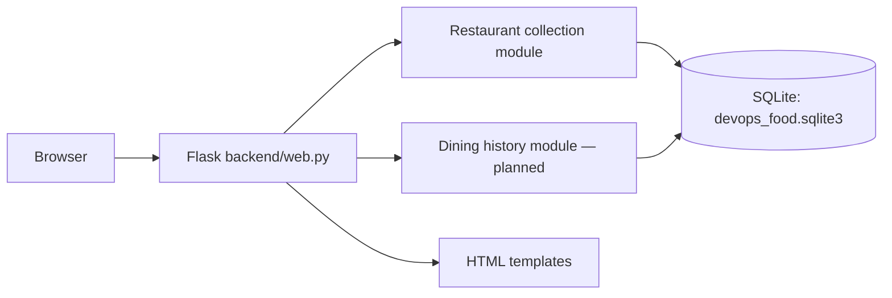
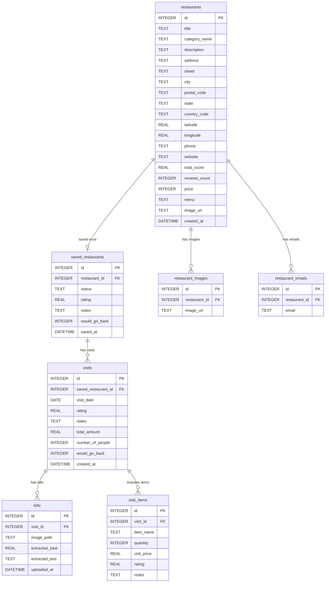

# Assignment 1 report — working outline

**Status:** Scaffold draft. Expand this to a 4–5 page report after the application and tests exist. Replace future-tense statements with what was actually built, and make both diagrams match the final code and SQLite schema.

## 1. Use case, stakeholder, and SMART goals

The proposed stakeholder is a person who wants one private place to keep restaurants they plan to try and a record of visits they have made. The professor approved the restaurant discovery and dining-history idea. Restaurant collection and dining history are the two backend feature areas.

Before submission, write specific, measurable goals for the finished app. Examples to evaluate and adapt: save a restaurant with category, city, and price in under one minute; retrieve a filtered list; record a visit with orders and an optional bill; keep all saved data after restart; reach at least 70% unit-test coverage of domain logic. Only claim a goal was met after checking it.

## 2. SDLC model and actual practice

The planned model is short iterative development. The first iterations produced a deployable scaffold, implemented the student-supplied schema, connected the student's `add_restaurant` and `remove_restaurant` functions to the saved-list page, added a separate full-catalog page, connected the student's `save_existing_restaurant` function to that page with a status choice, and connected the student's `get_restaurant_details` function to a detail page. Later iterations will add more restaurant behavior, visit behavior and uploads, then tests and final documentation. This fits a small individual project because each iteration can be run and inspected, and later findings can revise the next step. The final report should state where actual work followed or diverged from this plan, with dates or commits as evidence.

## 3. Architecture overview

The current app has one Flask process and one SQLite database file; bill files are planned under the same `DATA_DIR`. Restaurant creation through a form opened by the + control, saving an existing catalog row, saved-list removal, and separate saved, full-catalog, and detail views are implemented; dining-history behavior is planned. Recheck this diagram against the final submission.

The intended boundary is between general and personal restaurant facts on one side, and dated visits with orders and bills on the other. Both remain in one process and one database for Assignment 1.

## 4. Database model

The student supplied the single-user schema, which is implemented in `database/schema.sql`. The diagram below matches the seven tables created by SQLite. `SCHEMA.md` explains the columns and relationships in more detail.

`restaurants` contains general details. `saved_restaurants` contains the one user's personal status, overall rating, notes, and return preference; its `restaurant_id` is unique. Each saved entry can have several visits, and each visit can have several bills and ordered items. Foreign keys use cascading deletion. There is no `users` table. Bill image files are planned under `DATA_DIR`, and their locations will be stored in `bills.image_path` when uploads are implemented.

## 5. Testing, deployment contract, and reflection

**Pending implementation:** describe the actual unit tests for each domain, paste the coverage command and measured result, and explain what remained thin. Confirm that `python app.py` starts one process on `0.0.0.0`, uses `PORT`, initializes `DATA_DIR/devops_food.sqlite3`, and needs no interactive setup. Explain any tradeoffs discovered while implementing uploads, filtering, and privacy.

## AI disclosure statement

I acknowledge the use of OpenAI Codex to read the assignment, organize the repository, draft an initial Flask/SQLite scaffold, implement the student-supplied database schema and diagram, and connect the student's `add_restaurant`, `remove_restaurant`, `save_existing_restaurant`, and `get_restaurant_details` functions to the interface. The prompts used include “read the assingment md and htne set up the repo so it fills all the required documents fo the assingment”, “just build the scaffold dont one shot the whole app”, “set up the databse schemal and use sqlite then also make a schema daigram”, “i added a function called add_restaurant( in the restaurnt domain can you wire it a simple UI thanks”, “can you wire my new remove_resataurnt to the Ui thanks”, “make page where i can see the list of all the restaurants saved or nto”, “wire save_existing_restaurant to the all restaurant list”, “wire this to the UI so I can click on the restaurant and see the details”, and “make a plus button by the title that opens the add form”. The output of these prompts was used to create the initial project structure, SQLite schema implementation, matching diagram, form and removal routes, saved, full-catalog, and detail pages, an add-form toggle and save-existing status choice, styling, and draft documentation, which I will review and revise against the code and my own decisions before submission.
