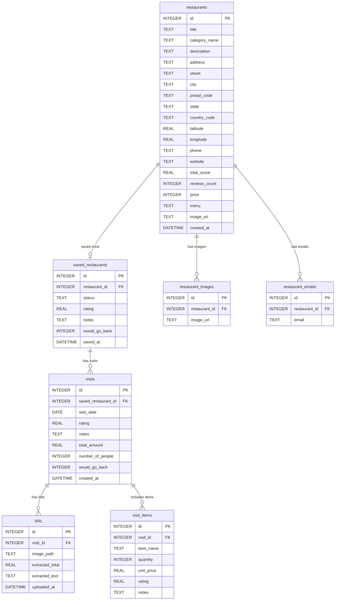

# SQLite schema and relationships

The student supplied the table and column design in the pasted schema. `database/schema.sql` is the executable version used by `database.initialize_database` at startup. It creates **seven tables** in `DATA_DIR/devops_food.sqlite3` (default `./data/devops_food.sqlite3`). There is no `users` table or `user_id`: this is a single-user app.

`restaurants` holds general restaurant details. `saved_restaurants` holds the single user's status, overall rating, notes, and return preference; its `restaurant_id` is unique, so one restaurant can have at most one saved entry. `visits` holds dated experiences. Each visit can have multiple bill rows and ordered items. Restaurant images and emails belong to the general restaurant record.

The location feature fills the existing `restaurants.address`, `restaurants.latitude`, and `restaurants.longitude` columns. The user can enter an address for a coordinate lookup or supply a coordinate pair manually on the detail page. The lookup cache is a separate JSON file under `DATA_DIR` and is not part of this SQLite schema. No table or column was added for this feature.

Removing a `saved_restaurants` row leaves its `restaurants` row in place, so the full catalog can still display it. The linked visits, bills, and items cascade away.

The three restaurant-related ratings have distinct meanings: `restaurants.total_score` is a general score stored with restaurant details, `saved_restaurants.rating` is the user's overall assessment, and `visits.rating` is one visit's assessment. `visit_items.rating` is for a particular dish. The catalog's minimum personal-rating filter uses `saved_restaurants.rating`.

SQLite foreign keys are enabled by `database.connect_database` for each connection, and all foreign keys in `database/schema.sql` cascade on deletion. The database is created on startup. Restaurant saving and listing, visit recording, ordered items, and bill uploads are implemented. Bill files are stored under `DATA_DIR/bills/`, while `bills.image_path` stores a relative path. The UI removes managed bill files when a saved restaurant is removed; SQLite itself only deletes the bill rows. The `extracted_total` and `extracted_text` columns are optional fields from the supplied schema, not evidence that receipt extraction exists.

The earlier three-table scaffold schema is incompatible. Startup detects that draft database and raises an error instead of silently mixing the old and new schemas. Use a new empty `DATA_DIR`, or migrate any data you need to keep.
